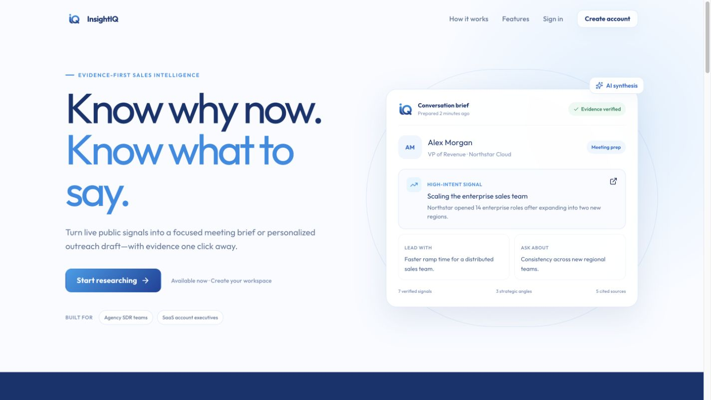
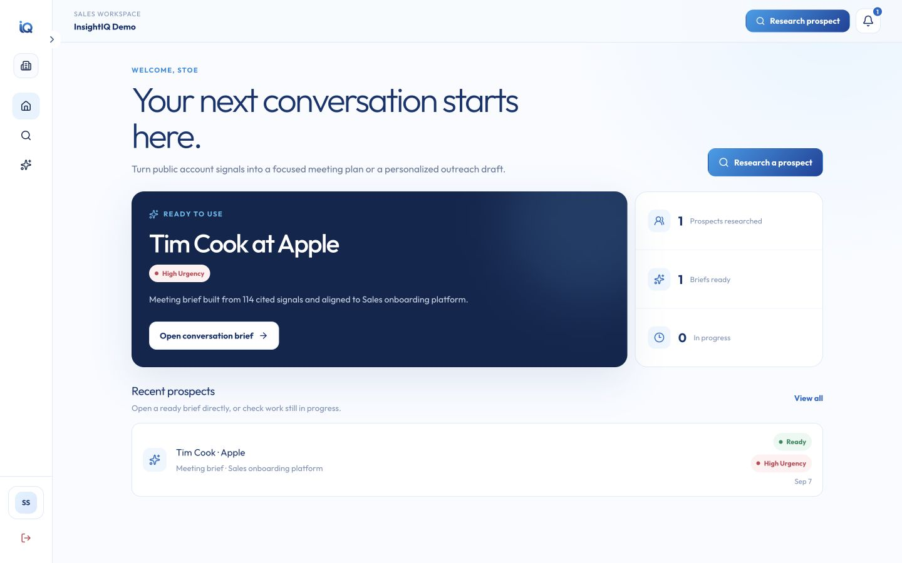
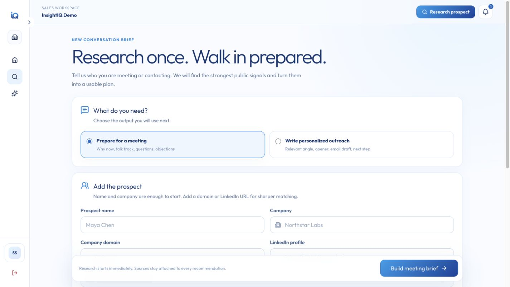
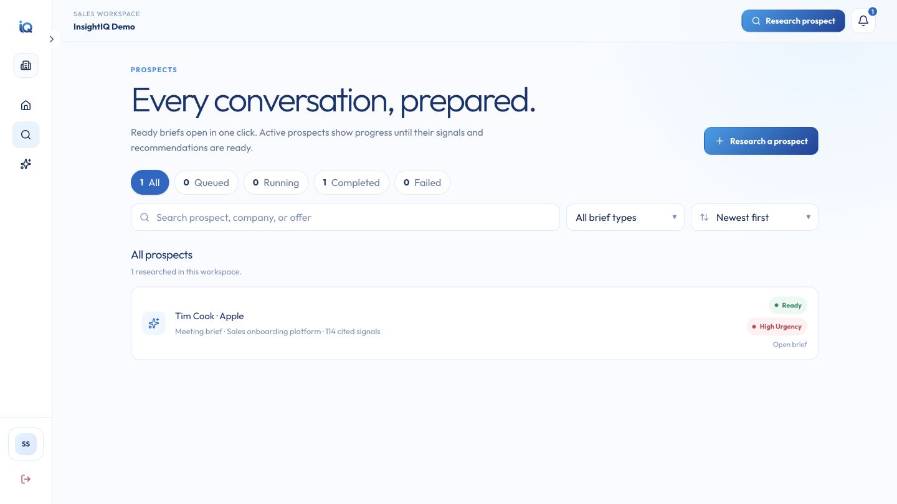
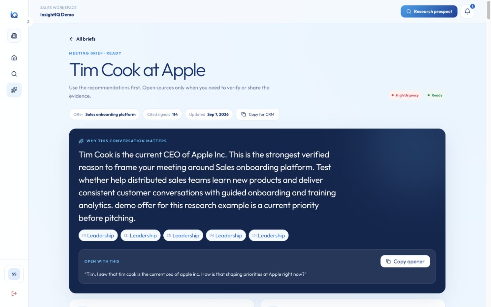
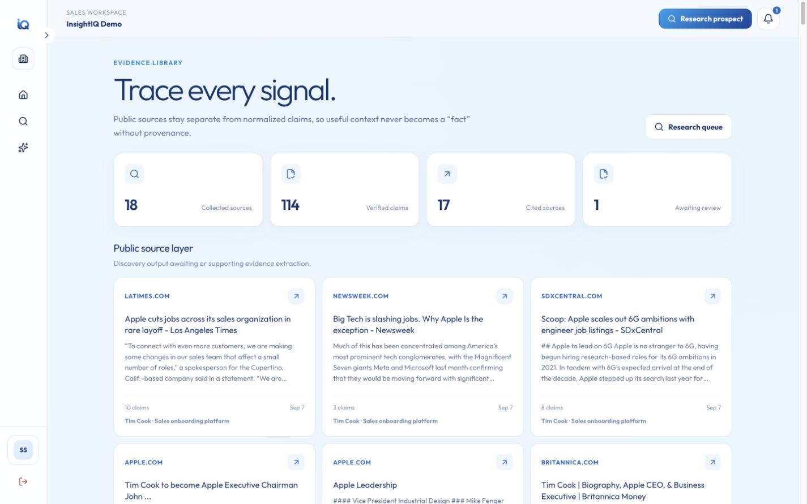
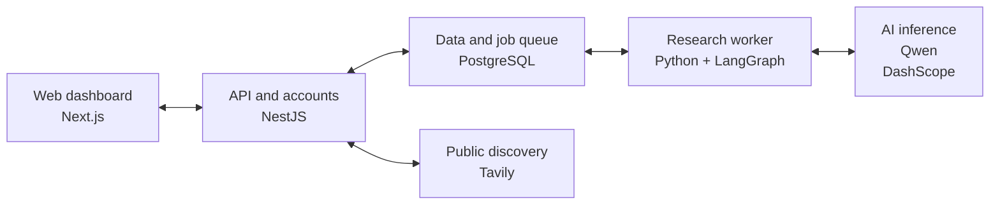

<p align="center">
  
</p>

<h1 align="center">InsightIQ</h1>
<p align="center"><strong>Turn prospect research into a conversation worth having.</strong></p>
<p align="center">
  <a href="https://insightiq.zerotools.online">Try InsightIQ</a> ·
  <a href="presentation/InsightIQ-pitch-enhanced.pptx">View the pitch</a> ·
  <a href="#getting-started">Get started</a> ·
  <a href="#supporting-attachments">Explore the attachments</a>
</p>

## Meet InsightIQ

InsightIQ is an AI sales research assistant for **B2B sales teams, agencies, and founders**. Give it a prospect and describe what you sell. It finds public signals and turns them into a **cited Deal Brief** for meeting preparation or personalized outreach—with source links and visible research gaps.

We built the complete journey: a shared workspace, public-source discovery, AI evidence extraction, and briefs you can review and reuse.

## Product tour

Click a preview to view the full desktop screenshot.

<table>
  <tr>
    <td width="50%" align="center">
      <strong>Landing page</strong><br />
      <a href="docs/assets/insightiq-landing.png"></a><br />
      <sub>Discover what InsightIQ does.</sub>
    </td>
    <td width="50%" align="center">
      <strong>Dashboard</strong><br />
      <a href="docs/assets/insightiq-dashboard.png"></a><br />
      <sub>See your workspace at a glance.</sub>
    </td>
  </tr>
  <tr>
    <td width="50%" align="center">
      <strong>New research</strong><br />
      <a href="docs/assets/insightiq-new-research.png"></a><br />
      <sub>Choose a goal and add prospect context.</sub>
    </td>
    <td width="50%" align="center">
      <strong>Prospect library</strong><br />
      <a href="docs/assets/insightiq-prospects.png"></a><br />
      <sub>Find prospects and open ready briefs.</sub>
    </td>
  </tr>
  <tr>
    <td width="50%" align="center">
      <strong>Deal Brief</strong><br />
      <a href="docs/assets/insightiq-brief.png"></a><br />
      <sub>Prepare your next sales conversation.</sub>
    </td>
    <td width="50%" align="center">
      <strong>Evidence library</strong><br />
      <a href="docs/assets/insightiq-evidence.png"></a><br />
      <sub>Inspect the sources behind the claims.</sub>
    </td>
  </tr>
</table>

*The landing page uses illustrative sample data. Product screenshots show AI-generated demo research on public Apple information; review the sources before using the outputs.*

## The idea: research with a purpose

A company profile can tell you what a business does. Preparing for a conversation means understanding **why your offer could matter to that prospect**. InsightIQ brings both sides together, keeping the evidence behind its suggestions within reach.

| Prepare for a meeting | Start a conversation | Check the evidence |
| --- | --- | --- |
| Talking points, discovery questions, likely objections, and next steps | Email and social drafts tailored to your prospect and offer | Source-linked signals, confidence scores, and clear research gaps |

## Getting started

1. **Enter your workspace.** [Create an account](https://insightiq.zerotools.online/sign-up) and verify your email.
2. **Add your context.** Enter a prospect's name, company, domain, or public profile, then describe what you sell.
3. **Choose your goal.** Pick meeting preparation or outreach and follow the research progress.
4. **Review your Deal Brief.** Check its sources and gaps, then use the talking points or adapt the draft.

## How it works

**Your prospect + your offer → public sources → evidence → a cited Deal Brief**

The API saves your context and discovers relevant public sources with **Tavily**, with Wikipedia as a fallback when discovery returns no sources. A background **Python worker** uses **Qwen through DashScope** to extract and reconcile claims. **LangGraph** then assembles a brief for your chosen goal, and a citation check matches each key signal to its stored claim and source before completion.

You can inspect the result, copy or export it, retry failed research, or regenerate a brief from stored evidence and compare changes. Missing evidence appears as a gap. Citations make claims traceable; review the sources and recommendations before use. Outreach is drafted for you to review and send.

## How we built it

Our guiding idea was simple: **keep evidence behind the output**. We store sources separately from claims and use accepted evidence to generate the brief. The web app handles the interactive experience while a background worker handles longer research jobs.



| Layer | Its job | Technology |
| --- | --- | --- |
| Web dashboard | Collect context and show progress, evidence, and briefs | Next.js, React, Tailwind CSS |
| API and accounts | Manage sign-in, workspaces, requests, and source discovery | NestJS, Better Auth, Tavily |
| Research worker | Extract evidence, generate briefs, and check citations | Python, LangGraph, Qwen/DashScope |
| Data and jobs | Store workspace records and queue background work | PostgreSQL, Prisma |

The web app runs on **Cloudflare Workers via OpenNext**. The API, research worker, and PostgreSQL run with **Docker Compose on a VPS**, with Nginx handling API traffic. PostgreSQL tracks the job queue, and database relationships keep research records tied to their workspace.

## Supporting attachments

A compact set of materials for exploring and presenting the project:

| Attachment | What's inside |
| --- | --- |
| [PowerPoint pitch](presentation/InsightIQ-pitch-enhanced.pptx) · [PDF pitch](supporting/InsightIQ-pitch.pdf) | Product story, desktop screenshots, workflow, architecture, and team |
| [Project overview](supporting/InsightIQ-overview.pdf) | A concise introduction to the idea and what we built |
| [Architecture diagram](supporting/InsightIQ-architecture.png) | The system architecture shown above |
| [Workflow diagram](supporting/InsightIQ-workflow.png) | From prospect context to a reviewable Deal Brief |
| [Demo inputs](supporting/InsightIQ-demo-inputs.csv) | Fictional prospect and offer examples for demonstrations; not a benchmark or measured results |
| [All attachments](supporting/InsightIQ-attachments.zip) | The supporting materials in one download |

## Contributors

**Afnan Ahmad Tariq · Danyal Rana · Hassan**

## For developers

<details>
<summary><strong>Run locally</strong></summary>

You'll need Node.js/npm, Python 3.9+, and a running PostgreSQL 17 database accessible from your machine.

```bash
cp .env.example .env
npm install
npm run worker:setup
```

Update `.env` with your database credentials, a generated `BETTER_AUTH_SECRET`, and Resend credentials for verification email. For the full research workflow, add `TAVILY_API_KEY` and `DASHSCOPE_API_KEY`.

Use these local authentication settings and clear `BETTER_AUTH_COOKIE_DOMAIN`:

```dotenv
BETTER_AUTH_URL=http://localhost:3001
BETTER_AUTH_TRUSTED_ORIGINS=http://localhost:3000
BETTER_AUTH_COOKIE_DOMAIN=
WEB_ORIGIN=http://localhost:3000
```

Quote `.env` values that contain spaces (including `RESEND_FROM_EMAIL`). Start the application from a shell with these variables exported so the Python worker receives them too:

```bash
set -a
source .env
set +a
npm run db:migrate:dev
npm run dev
```

Open `http://localhost:3000`. The API runs on port `3001`. The production Compose database does not publish a host port, so local Node/Python processes need a separately reachable database or a local Compose port override.

Quality checks: `npm run build`, `npm run lint`, `npm run check-types`, and `npm test`.

Repository layout: `apps/web`, `apps/api`, `apps/worker`, and `packages/db`.

</details>
