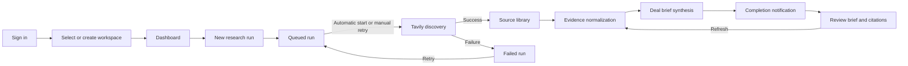

# InsightIQ user flows

This document describes the product journey represented by the current routes
and shipped worker pipeline. UI states reflect stored data, including distinct
queued, running, refreshing, completed, and failed states.

## Primary research journey

## Product routes

| Route | User purpose | Current data boundary |
| --- | --- | --- |
| `/dashboard` | See workspace activity and continue recent work | Research-run counts and recent runs |
| `/dashboard/research` | Track all queued, running, completed, and failed runs | Tenant-scoped research runs |
| `/dashboard/research/new` | Submit identifiers, offer context, and output goal | Atomically creates prospect, offer, and immutable run snapshot |
| `/dashboard/research/:id` | Launch or retry discovery and inspect each pipeline stage | Run, raw sources, evidence, and brief relationship |
| `/dashboard/evidence` | Review sources separately from accepted claims | Cross-run source and evidence library |
| `/dashboard/briefs` | Browse completed or draft outputs | Cross-run deal brief list |
| `/dashboard/briefs/:id` | Use structured meeting or outreach sections with citations | One tenant-scoped brief and its run evidence |
| `/dashboard/profile` | Review or update personal identity details | Signed-in user profile; email changes require current-inbox confirmation |
| `/dashboard/settings` | Manage 2FA and account deletion | Signed-in user security and account records |
| `/dashboard/workspace` | Manage workspace identity, members, invitations, and data | Active workspace; destructive actions require admin access |
| `/dashboard/integrations` | Understand operational and upcoming pipeline stages | Non-secret provider configuration and readiness |

Completion and attention events appear in the dashboard notification popover;
there is no dedicated notifications route.

## Research states

| State | Meaning | Available action |
| --- | --- | --- |
| `queued` | Inputs are preserved and the run is ready to be claimed | Start source discovery |
| `running` with no sources | A discovery request has claimed the run | Refresh status |
| `running` with sources | Discovery is complete; evidence and brief processing remains | Inspect sources while the page polls automatically |
| `running` with a `refreshing` brief | A completed brief is being synthesized again from stored evidence | Continue using the existing brief while the page polls automatically |
| `failed` | Discovery stopped with a safe error message | Requeue and retry discovery |
| `completed` | Evidence and a final brief have completed | Open the deal brief and citations |

## Shipped worker contracts

### Evidence normalization

Input:

- one `ResearchRun` in `running` state;
- its tenant-scoped `EvidenceSource` records;
- the immutable prospect, offer, and goal snapshot.

Output:

- bounded `Evidence` claims with a signal type and confidence score;
- every claim linked to one source in the same workspace;
- no claim accepted when the source relationship cannot be preserved.

### Deal brief synthesis

Input:

- accepted evidence only;
- the offer context and requested goal;
- no uncited search snippets as factual context.

Output:

- a structured `DealBrief.sections` object whose keys can vary by goal;
- meeting preparation sections such as questions and objection handling, or
  outreach sections such as email and social drafts;
- completion status and a notification for the requesting user.
